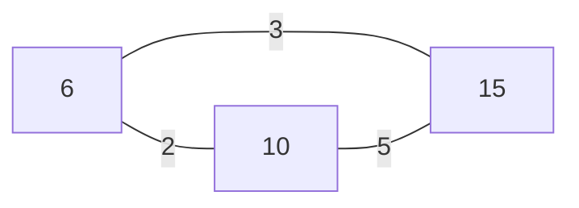
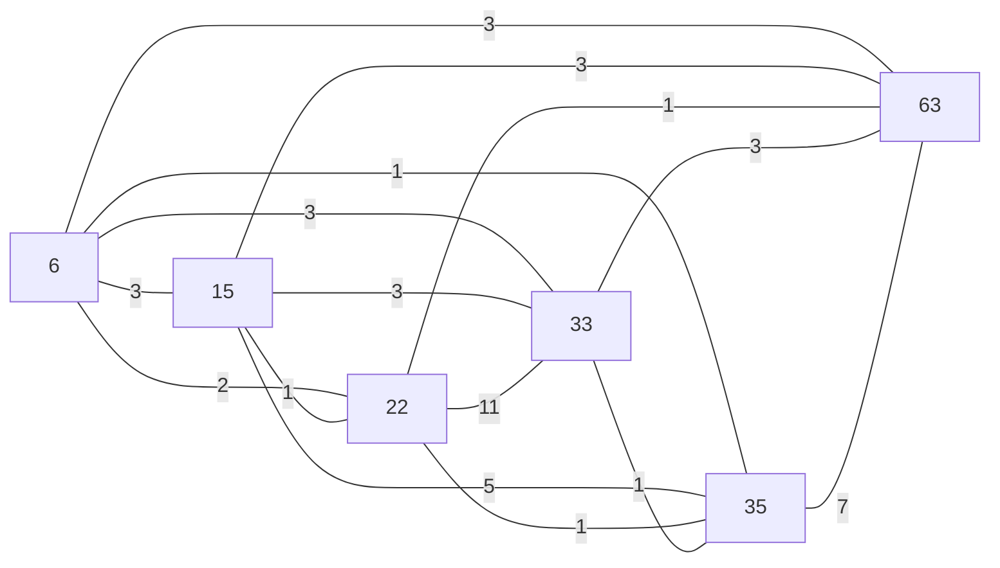
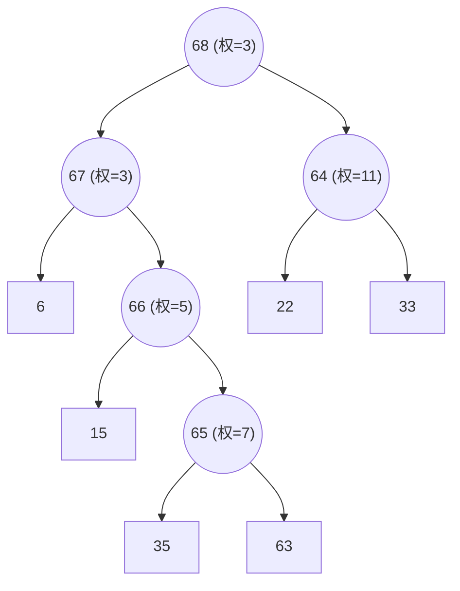

题目链接：[GCD 之旅](https://qoj.ac/contest/3758/problem/18281)  
可能需要先加入团队：[2026 ICPC Nanchang Invitational](https://qoj.ac/group/join/5mpI3PQvgDPIN7jdD9nQfsmjlAV89wVD)

# 题面

## Problem J. GCD 之旅

在神奇的 Numerian 魔法王国中，有 n 座城市，每座城市都拥有自己的魔法能量值 $a_i$。国王在每两座城市之间都修建了双向道路，其中连接城市 $u$ 和城市 $v$ 的道路的守护符强度（Guardian Charm Degree，简称 GCD）等于 $\gcd(a_u, a_v)$，即两座城市魔法能量值的最大公约数。

旅行者从城市 $x$ 前往城市 $y$ 时，其旅程的魔法免疫指数（Magical Immunity Number，简称 MIN）等于所经过的所有道路中 GCD 的最小值。王国的皇家顾问认为一次旅程是“强免疫”的，当且仅当它的 MIN 达到了可能的最大值。

你的任务是回答国王的 $q$ 次询问。对于每次询问 $(x, y)$，输出从城市 $x$ 到城市 $y$ 的所有路径中，可能的 最大 MIN。

特别地，如果 $x = y$，旅行者没有离开城市，此时 MIN 等于该城市自身的魔法能量值 $a_x$。

**Input**

第一行包含两个整数 $n$ 和 $q$ ($1 \le n, q \le 10^6$)。

第二行包含 $n$ 个整数 $a_1, a_2, \cdots, a_n$ ($1 \le a_i \le 10^6$)，表示每座城市的魔法能量值。

接下来 $q$ 行，每行包含两个整数 $x$ 和 $y$ ($1 \le x, y \le n$)，表示一次询问。

**Output**

对于每次询问，输出一行一个整数，表示可能的最大 MIN。

**Example**

| standard input | standard output |
| :--- | :--- |
| 6 3 | 7 |
| 6 15 22 33 35 63 | 3 |
| 5 6 | 15 |
| 3 5 | |
| 2 2 | |

**Note**

对于样例，魔法能量值 $a = [6, 15, 22, 33, 35, 63]$。

第 1 组询问：最优路径为 5 → 6，答案为 $\gcd(35, 63) = 7$。

第 2 组询问：最优路径为 3 → 4 → 6 → 5，三条边的 GCD 分别为 $\gcd(22, 33) = 11$，$\gcd(33, 63) = 3$，$\gcd(63, 35) = 7$，答案为 $\min(11, 3, 7) = 3$。

第 3 组询问：由于 $x = y$，旅行者没有离开城市，答案为 $a_2 = 15$。


# 题解

## 形式化题意
- 有一个 $n$ 个点的**完全图**。
- 点 $u$ 和点 $v$ 之间的无向边权为  
  $
  w(u,v) = \gcd(u, v)
  $
- 有 $p$ 组询问，每次询问：  
  从 $u$ 到 $v$ 的**所有路径**中，**路径上边权的最小值** 的 **最大值**。


## 问题转换

>[!TIP]
> 这个最大值等于在**最大生成树**（按边权从大到小构建）上，$u$ 到 $v$ 路径上的最小边权。

### 举个例子

比如点集 {6, 10, 15}，边权如下：
- (6, 10): $\gcd(6, 10) = 2$
- (6, 15): $\gcd(6, 15) = 3$
- (10, 15): $\gcd(10, 15) = 5$

那么图如下：



对于 6->10 的路径，有：


- 边权为 2，路径的最小边权为 2


和：


- 边权为 3 和 5，路径的最小边权为 3

很明显，第二种路径的最小边权更大，所以答案是 3  

又比如对于题目给出的例子，点集 {6, 15, 22, 33, 35, 63}，边权如下：
- (6, 15): $\gcd(6, 15) = 3$
- (6, 22): $\gcd(6, 22) = 2$
- (6, 33): $\gcd(6, 33) = 3$
- (6, 35): $\gcd(6, 35) = 1$
- (6, 63): $\gcd(6, 63) = 3$
- (15, 22): $\gcd(15, 22) = 1$
- (15, 33): $\gcd(15, 33) = 3$
- (15, 35): $\gcd(15, 35) = 5$
- (15, 63): $\gcd(15, 63) = 3$
- (22, 33): $\gcd(22, 33) = 11$
- (22, 35): $\gcd(22, 35) = 1$
- (22, 63): $\gcd(22, 63) = 1$
- (33, 35): $\gcd(33, 35) = 1$
- (33, 63): $\gcd(33, 63) = 3$
- (35, 63): $\gcd(35, 63) = 7$   


把所有的边连起来：


对于 35->63 的路径，有：


- 边权为 7，路径的最小边权为 7  

和：


- 边权为 5、3 和 3，路径的最小边权为 3
第一种路径的最小边权更大，所以答案是 7


很明显，我们希望图联通，并且每一条边的边权都尽可能大，这样才能保证路径上的最小边权也尽可能大  

所以，这个问题就变成了：**在最大生成树上，求 $u$ 到 $v$ 路径的最小边权**


## 该怎么做


### 最大生成树（Kruskal重构树）

>[!WARNING]
> 我们不能直接 Kruskal 构建最大生成树，因为完全图有 $\frac{n(n-1)}{2}$ 条边，无法直接枚举  


#### GCD与边权的关系

>[!TIP]
>我们不难发现对于$i$与$j$,如果$j=n \times i$,那么$\gcd(i, j) = i$，也就是说$i$与它的倍数之间的边权为$i$，而对于其他不满足倍数关系的边权则会更小  
>所以，我们可以直接从大到小枚举边权 $i$，将每个 $i$作为一个虚拟节点，将所有满足 $\gcd(i, j) = i$ 的$j$作为子节点，这样就能构建出最大生成树了


:::note[建树具体步骤]
1. 从大到小枚举边权 $i$
2. 维护一个变量 $edj$、$j$、$idx$，表示当前边权 $i$ 的上一个满足条件的节点、当前枚举的节点、当前新建节点的编号
3. 如果存在值为$n\times i$的点$j$，将$edj$和$j$所在的子树合并到新建节点$idx$上，并更新$edj$为$idx$，$j$继续枚举下一个满足条件的节点
4. 如果$edj$与$j$所在的子树已经在同一个集合中，则直接更新$edj$为$j$，继续枚举下一个满足条件的节点

:::

比如，对于我们之前的例子{6,15,22,33,35,63}，我们重构出的最大生成树如下(圆形为虚拟节点)：



**code**
```cpp
// pos[i] 存储值为 i 的点的编号,判断是否存在有这个值的点
int idx = maxa + 1;// idx 代表当前加入的边的编号，初始值为 maxa + 1，因为已经存在的点的编号是从 1 到 maxa 的
for (int i = maxa; i >= 1; i--)
{
    int edj = -1;
    for (int j = i; j <= maxa; j += i)
    {
        if (edj == -1 && pos[j].size())
        {
            edj = j;
        }
        else if (pos[j].size())
        {
            int ri = find(edj);
            int rj = find(j);
            if (ri != rj)
            {
                e[idx].push_back({ri, i});
                e[idx].push_back({rj, i});
                e[ri].push_back({idx, i});
                e[rj].push_back({idx, i});
                p[ri] = idx;
                p[rj] = idx;
                p[idx] = idx;
                edj = idx;
                idx++;
            }
            else
            {
                edj = j;
            }
        }
    }
}
```

### 路径的最小边权 (使用LCA最近公共祖先求解)

现在我们已经构建了最大生成树，那么对于每次询问 $(u, v)$，我们要怎么求出 $u$ 到 $v$ 路径上的最小边权呢

>[!TIP]
>我们可以使用LCA来求出LCA(u, v)，然后在$u$到LCA(u, v)和$v$到LCA(u, v)的路径上分别求出最小边权，最后取两者的最小值即可  
>至于两条路径上的最小边权，可以直接在预处理倍增跳跃的时候预处理掉

:::note[倍增LCA算法具体步骤]
1. 选择一个节点作为根节点，进行 DFS 遍历，记录每个节点的深度`dep[node]`和父节点
2. 构建一个 $n \times \log n$ 的数组 `f[node][j]`，其中 `f[node][j]` 表示节点 `node` 的第 $2^j$ 个祖先
3. 在 DFS 遍历过程中，同时记录从节点 `node` 到其父节点的边权，并在 `d[node][j]` 中预处理出从 `node` 到其第 $2^j$ 个祖先路径上的最小边权
4. 对于每次查询 $(u, v)$，先将深处的节点上跳到同一深度，然后一起上跳直到找到 LCA，过程中记录路径上的最小边权，最后返回两条路径上的最小边权的最小值
:::

**code**
```cpp
vector<int> dep(N, 0);
vector<int> pw(21, 0);
int f[N][21];
int d[N][21];
void getpow()// 预处理 2^i 的值
{
    for (int i = 0; i < 21; i++)
    {
        if (i == 0)
        {
            pw[i] = 1;
        }
        else
        {
            pw[i] = pw[i - 1] * 2;
        }
    }
}
void dfs(int now, int fa)// 预处理倍增跳跃以及跳跃最小边权
{
    dep[now] = dep[fa] + 1;
    f[now][0] = fa;
    for (int i = 1; pw[i] <= dep[now]; i++)
    {
        f[now][i] = f[f[now][i - 1]][i - 1];//倍增跳跃
        d[now][i] = min(d[now][i - 1], d[f[now][i - 1]][i - 1]);
    }
    for (auto s : e[now])
    {
        if (s.u != fa)
        {
            d[s.u][0] = s.v;// s.v 就是边权
            dfs(s.u, now);
        }
    }
}
int lca(int x, int y)// 求 u 到 v 路径上的最小边权
{
    int res = 1e9;
    if (dep[x] > dep[y])
    {
        swap(x, y);
    }
    for (int i = 20; i >= 0; i--)// 先将较深的节点上跳到同一深度
    {
        if (dep[x] <= dep[y] - pw[i])
        {
            res = min(res, d[y][i]);
            y = f[y][i];
        }
    }
    if (x == y)
    {
        return res;
    }
    for (int i = 20; i >= 0; i--)// 一起上跳直到找到 LCA
    {
        if (f[x][i] != f[y][i])
        {
            res = min(res, d[x][i]);
            res = min(res, d[y][i]);
            x = f[x][i];
            y = f[y][i];
        }
    }
    res = min(res, d[x][0]);
    res = min(res, d[y][0]);
    return res;
}
```


## AC Code

```cpp
#include <bits/stdc++.h>
using namespace std;
#define int int64_t
const int N = 2e6 + 5;
vector<int> a(N, 0);
vector<int> pos[N];
vector<int> p(N, 0);
struct node
{
    int u;
    int v;
};
vector<node> e[N];
int find(int x)
{
    if (p[x] == x)
    {
        return x;
    }
    return p[x] = find(p[x]);
}

void marge(int x, int y)
{
    x = find(x);
    y = find(y);
    if (x != y)
    {
        p[x] = y;
    }
}

vector<int> dep(N, 0);
vector<int> pw(21, 0);
int f[N][21];
int d[N][21];
void getpow()
{
    for (int i = 0; i < 21; i++)
    {
        if (i == 0)
        {
            pw[i] = 1;
        }
        else
        {
            pw[i] = pw[i - 1] * 2;
        }
    }
}
void dfs(int now, int fa)
{
    dep[now] = dep[fa] + 1;
    f[now][0] = fa;
    for (int i = 1; pw[i] <= dep[now]; i++)
    {
        f[now][i] = f[f[now][i - 1]][i - 1];
        d[now][i] = min(d[now][i - 1], d[f[now][i - 1]][i - 1]);
    }
    for (auto s : e[now])
    {
        if (s.u != fa)
        {
            d[s.u][0] = s.v;
            dfs(s.u, now);
        }
    }
}

int lca(int x, int y)
{
    int res = 1e9;
    if (dep[x] > dep[y])
    {
        swap(x, y);
    }
    for (int i = 20; i >= 0; i--)
    {
        if (dep[x] <= dep[y] - pw[i])
        {
            res = min(res, d[y][i]);
            y = f[y][i];
        }
    }
    if (x == y)
    {
        return res;
    }
    for (int i = 20; i >= 0; i--)
    {
        if (f[x][i] != f[y][i])
        {
            res = min(res, d[x][i]);
            res = min(res, d[y][i]);
            x = f[x][i];
            y = f[y][i];
        }
    }
    res = min(res, d[x][0]);
    res = min(res, d[y][0]);
    return res;
}

int32_t main()
{
    getpow();
    int n, q;
    cin >> n >> q;
    int maxa = 0;
    for (int i = 1; i <= n; i++)
    {
        cin >> a[i];
        pos[a[i]].push_back(i);
        maxa = max(maxa, a[i]);
    }
    for (int i = 1; i <= maxa; i++)
    {
        p[i] = i;
    }
    int idx = maxa + 1;
    for (int i = maxa; i >= 1; i--)
    {
        int edj = -1;
        for (int j = i; j <= maxa; j += i)
        {
            if (edj == -1 && pos[j].size())
            {
                edj = j;
            }
            else if (pos[j].size())
            {
                int ri = find(edj);
                int rj = find(j);
                if (ri != rj)
                {
                    e[idx].push_back({ri, i});
                    e[idx].push_back({rj, i});
                    e[ri].push_back({idx, i});
                    e[rj].push_back({idx, i});
                    p[ri] = idx;
                    p[rj] = idx;
                    p[idx] = idx;
                    edj = idx;
                    idx++;
                }
                else
                {
                    edj = j;
                }
            }
        }
    }
    for (int i = 0; i < 21; i++)
    {
        f[0][i] = 0;
        d[0][i] = 1e9;
    }
    int rt = idx - 1;
    d[rt][0] = 1e9;
    dfs(rt, 0);
    while (q--)
    {
        int u, v;
        cin >> u >> v;
        if (a[u] == a[v])
        {
            cout << a[u] << endl;
        }
        else
        {
            cout << lca(a[u], a[v]) << endl;
        }
    }
}
```