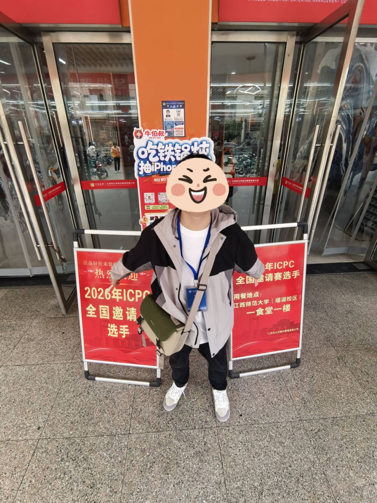
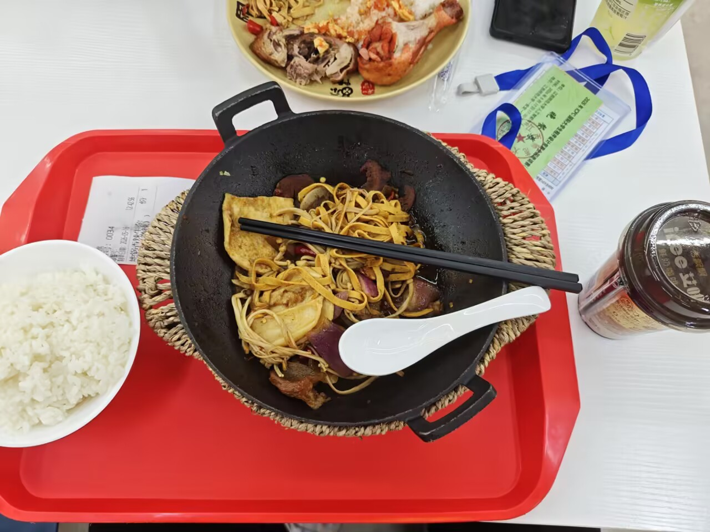
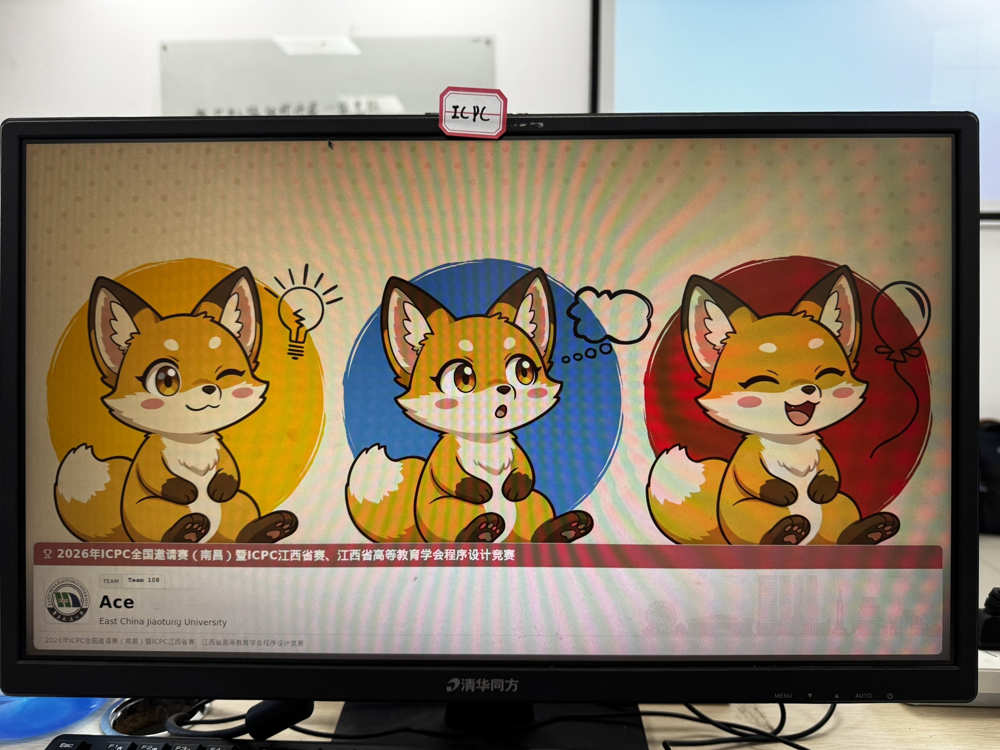

其实，昨天晚上做了个梦，梦到今天只开出来两题。。。  
是实话，玄学这种东西，是真的有点说法，比完赛后去洛谷打卡，结果两个凶一个大凶（），也确实是完美对上了结果。。。  

# 15号（距离正赛两天）

这天中午还被拉去做题，其实我总认为赛前是应当休息的，无奈只好敷衍着开了两题，随后直接已读不会了。。。   
晚上又整理了一下板子，补充了一下拓展库的rope还有pbds的hash_table（完全没有用到啊）

# 16号（距离正赛一天）

感谢一下我的好室友，为了防止我醒不来，特地熬了个通宵，在七点钟把我叫了起来才睡觉  
随后前往师大，不得不说师大还是很气派的，和队友会和之后，领到了书包和T恤，感觉还是挺不错的。  
中午用餐券吃了一顿1块钱的铁锅炖，味道还不错。

下午打热身赛，A题签到，做完之后我就去开C题了，是一道dfs爆搜的题，但是呢赛场上没有看出来，莫名其妙的感觉是不是能二分着来做，本来想问问队友，来check一下思路，结果队长说这么简单的题讨论什么。。。  
最后一直在错误的思路下调代码，不出意外的一直WA。。。  
这个时候其实已经有点不高兴了，没有兴趣吃晚饭，就直接回酒店点外卖，顺带把C题开出来了  

晚上迷迷糊糊的就睡着了，突然被梦惊醒，看了一眼手表，发现是3点钟，庆幸着只是梦而已，又睡回去了。。。  

# 17号（正赛）

早上在酒店稍微吃了一点，就前往赛场了。

赛前锁屏壁纸，好可爱

A题签到，被队友直接秒了  
接下来就是噩梦一样的4小时57分钟，我先去开了H，但是只想出来2的那种情况，后面的nim博弈确实是写不来啊，另一个队友开B，队长去开I，但是都没什么进展  

就这样僵持着，直到我去看了一下B，发现其实只要判断一下两个相同颜色之间是否都是同点数或者同颜色就可以了，告诉队长，结果他又来质疑我（说那你怎么去模拟交换巴拉巴拉），又持续了好一会，直到他确实是对I题没有一点思路，才让我去敲了B，结果不出所料，一发直接AC   

然后让我看了一眼I，我搓了几个他的代码会错的样例，他的贪心确实是错的。。。

直到最后，也没能再出一题。。。

走出赛场那种欲哭无泪的感觉，实在是不太好过   
甚至不敢面对教练，不敢面对另外的拿金的学长  

# 赛后谈

昨晚梦见挣扎在两道题上，三点钟从睡梦中惊醒，庆幸只是梦境。然而，当梦境照进现实，却没法让自己醒来。。。

其实，也许结果早有预兆，  
当压力胜过求知的热情，  
当热爱变成无限堆积的ddl，  
当谦卑化为无源的自负。。。

Ace（12/10/2025--05/17/2026），始于一场比赛，也终于一场比赛，  
尽管这个句号画的不甚完美。

当AI的上下文太长或者被污染的时候该怎么办呢，  
Claude code给出的答案是切换到全新的上下文窗口。也许我应该停下来，重置一下状态。

静下心来，未来的路，让我随着自由的风飘向梦吧

🎶  

风飘过去  
带走了思绪  
我该去哪里？ 

风飘过去  
卷走几朵云  
天空变得清晰  

风飘过去
忘掉了意义  

风飘过去  
下起了毛毛雨  

风飘过去~

我想像风一样自由可以飘到很远处~  
想像风一样果敢可以吹走眼前雾~  
想像风一样洒脱不用担心在哪住~  
想像风一样活着 哦～  
这么活着～  

听见它说~  

吹着风  
晒太阳  
采露水给树叶梳妆  

追着梦  
赏月亮  
夜空中它微微发亮  

灰蒙蒙  
会彷徨  
跟着心向往的方向  

🎶

